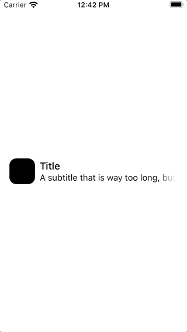

# MarqueeText

A SwiftUI Marquee or "scrolling text" efect found in Apple native apps. For when one line isn't enough, but two is just too much 😉



## Usage
Add this repository as a Swift Package Dependency to your project. You find the option in Xcode unter "File > Swift Packages > Add Package Dependency...". Paste the link to this project in and voila!

```swift
import SwiftUI
import MarqueeText

struct ContentView: View {    
    var body: some View {
     MarqueeText(
     text: "A subtitle that is way too long, but it scrolls homie",
     font: UIFont.preferredFont(forTextStyle: .subheadline),
     leftFade: 16,
     rightFade: 16,
     startDelay: 3
     )
   }
}
```

## License

You can use this software under the terms and conditions of the MIT License.

Joe Kennedy © 2020
